# Eularian Path
- Either will have eularian cycle
- Start and end at different vertices
# Eularian Cycle
- if a graph is connected, and the degree of every vertex is even then it must have eularian cycle
# Finding an Eularian path 
1. Check if eulerian path exist
    - Count out/in degree of each node
    - At most one vertex has (outdegree) - (indegree) = 1
    - At most one vertext has (indegree) - (outdegree) = 1
    - All other vertices has equal and out degree
    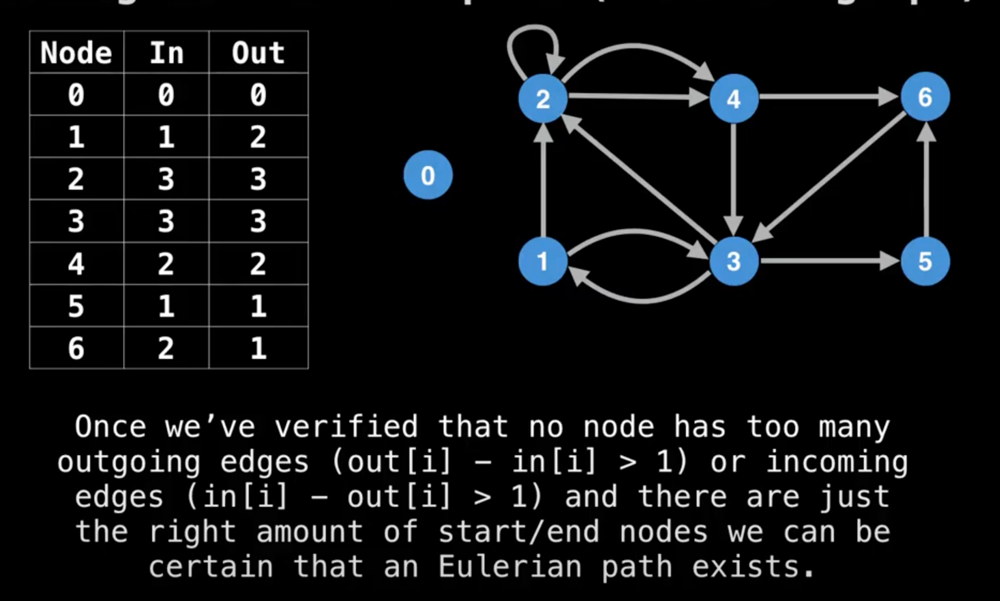
2. Find a valid starting and ending node
    - Starting node: Node with exactly one extra outgoing edge
    ```
    out[1] - in[1] = 2 -  1 =  1
    ```
    - Ending node: Node with exactly one extra incoming edge
    ```
    in[6] - out[6] = 2 -  1 =  1
    ```    
    Note: If all in and out degree are equal (Eulerian cycle case) then any node with non zero degree will servce as suitable starting node.
3. Can we apply `DFS`?
    - Simple DFS traverse all nodes for given starting node but skip edges
    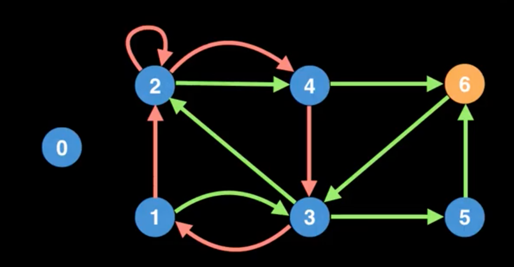
    - I.e. simple DFS with random edge selection doesn't find eulerain path even graph does have eulerain path
    - Modify `DFS` to force to traverse all edge
        - Keep track of unvisited edges
        - If no unvisited edges to current node then add node into soln at the front
        - Example
        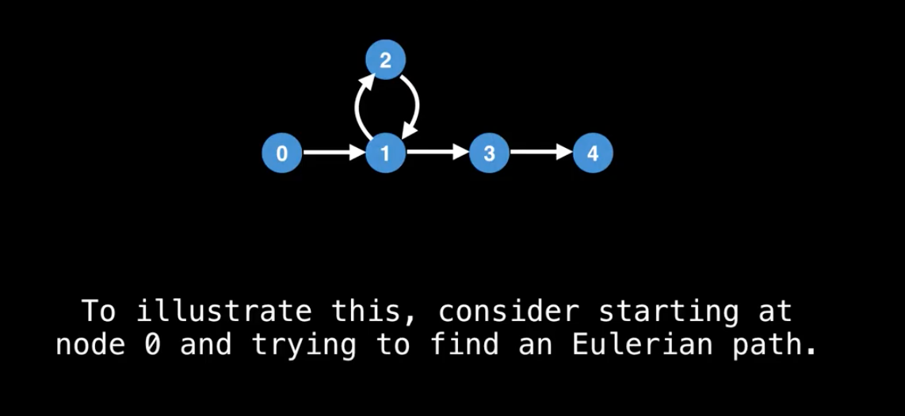
        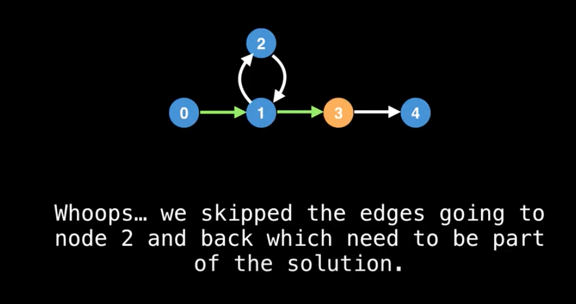
        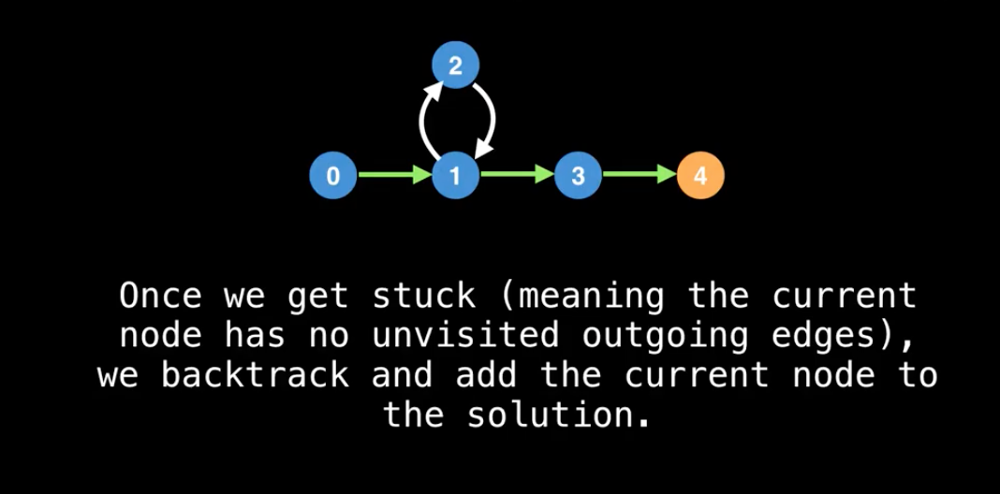
        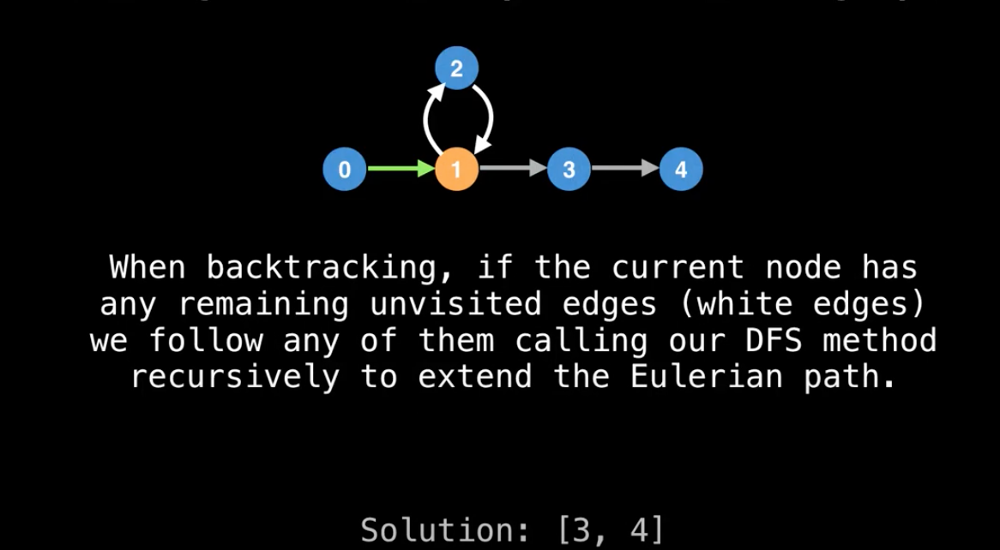
        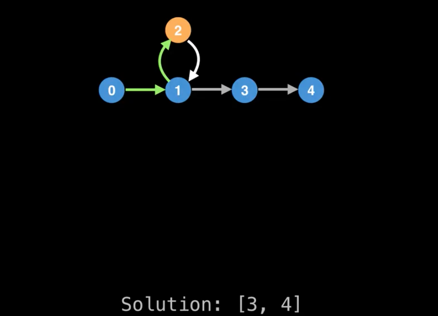
        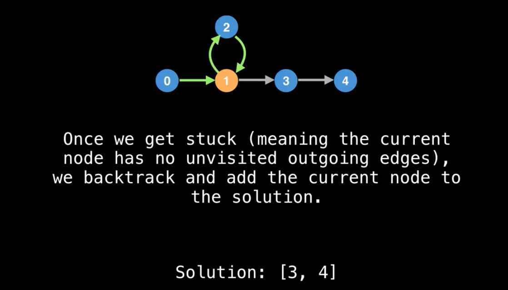
        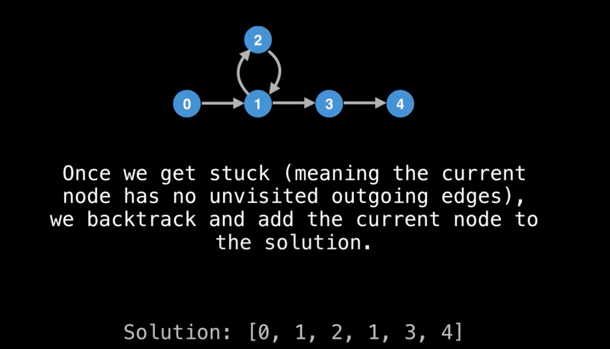

    - Apply modified `DFS` to get eulerian path
        - We don't need `in` degree one eulerain path exist has been check
        - We only need to focus on `out` degree to track number of unvisited edges
        - Every time edge is taken, reduce the outgoing edge count in the out array
        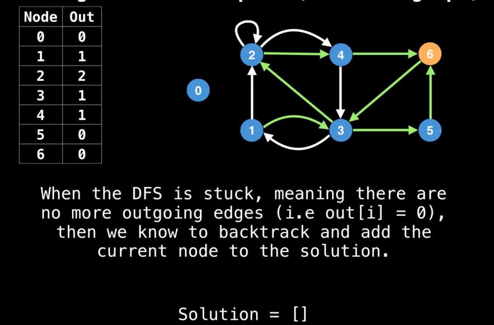
        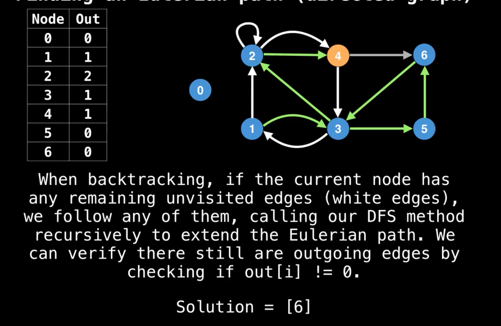
        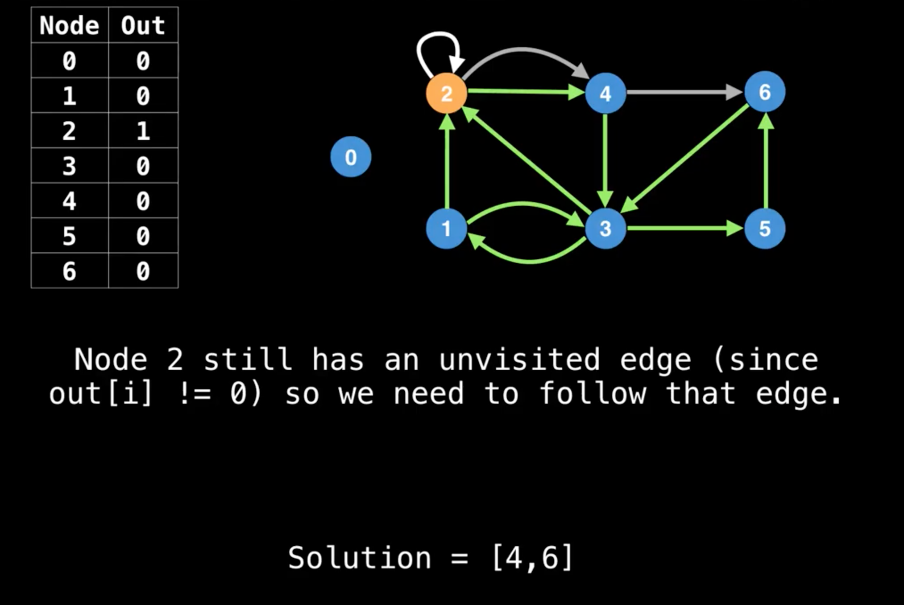
        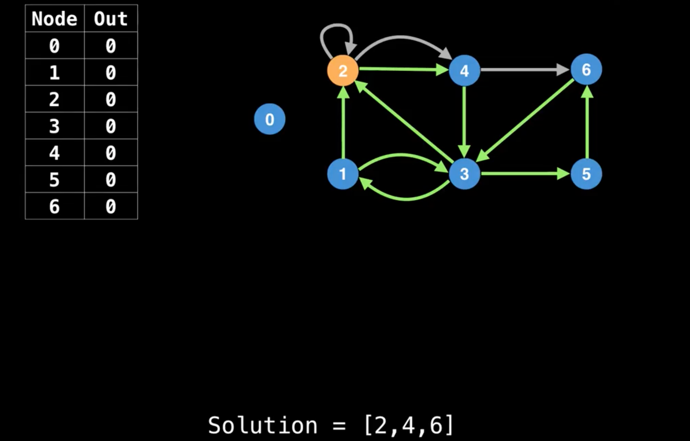
        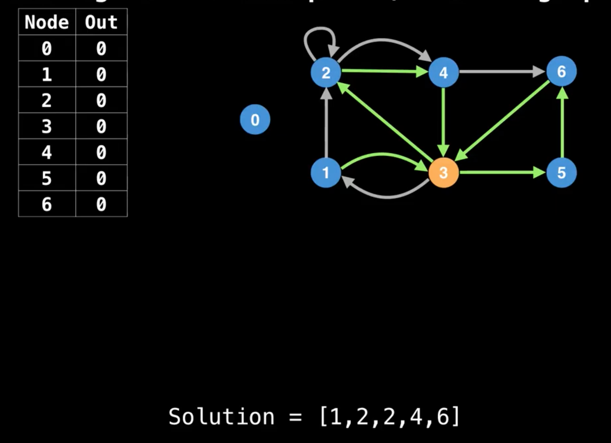
        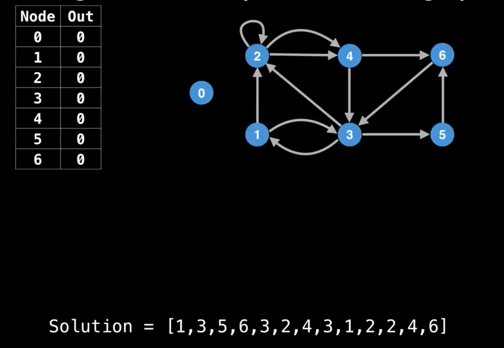
        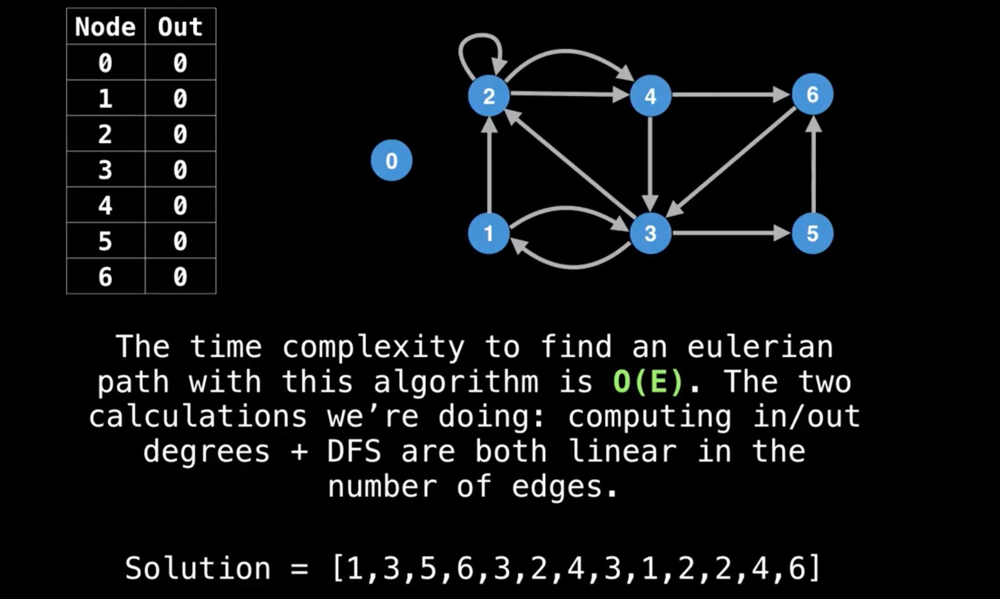
This is called `Hierholzer's algorithm`

# Reference
https://www.youtube.com/watch?v=8MpoO2zA2l4&ab_channel=WilliamFiset