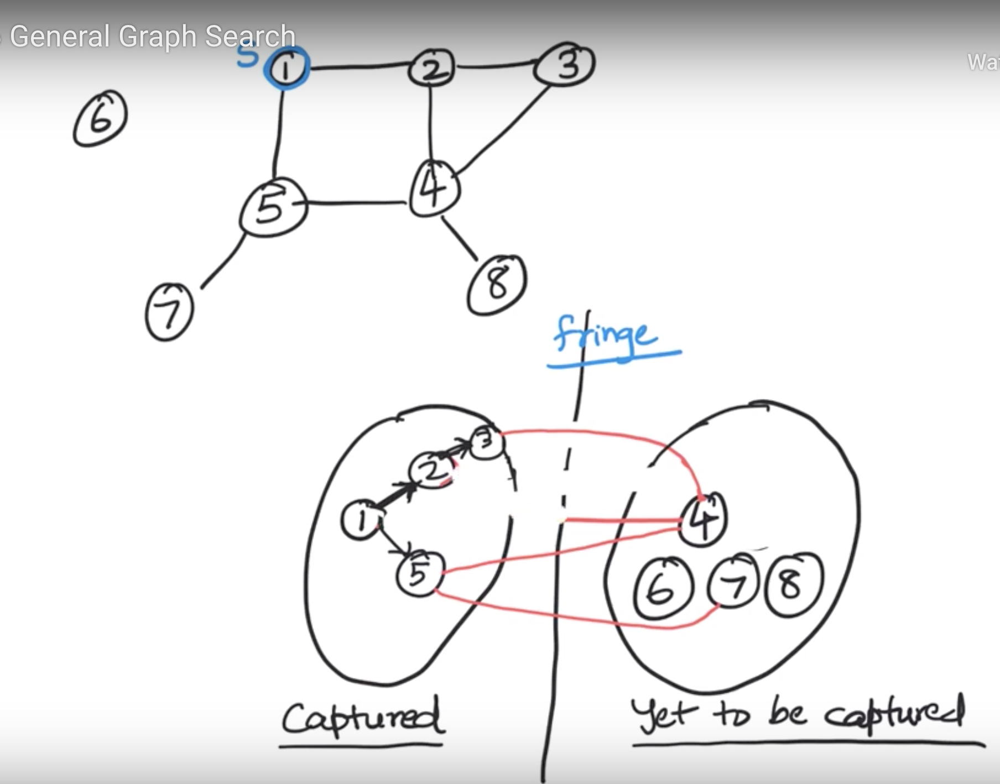

# Disconnected Graph
- If disconnected (i.e. edges of the graph are split across multiple connected components) there cannot be eulerian cycle.
- Even if the degree of every vertex is even
# How to check if graph is connected or not?
- Start from any vertex `S` as a source
- Traverse graph to find all reachable vertices from `S`
- If you miss out any vertices from traversed graph that means graph is not connected
# Generic graphq traversal algo
## Captured vs Yet to capture approach
- Start from any node `S` and put into captured group
- Find out nodes connected to `S` and not yet captured, and put into 'Yet to be captured` group
- Maintain the relationship based on source node and adjacent node in captured group


## Search Tree
- A tree as per captured group
## Set of captured vertices
- List as per captured group
## Algo template
```
class Search {
    search(s){
        // captured and parent initialize to 0 and null
        // set source as captured
        captured[s] = 1;
        while there exists a fringe edges:
            pick one of them (u,v) => {
                captured[v] = 1
                parent[v] = u
            }

    }
}
```
- All the major graph follow this basic template
- Template is even applicable for directed graph
- BFS, DFS, Prim's, Dijkstra etc all follow the same template
- Only difference is the policy to decide which fringe element to pick first
- Different algorithm leads to different search tree

# Graph Search algorithm comparison
## 1. BFS
### Policy
- Choose fringe edge that was seen first
### Search tree
- BFS tree
## 2. DFS
### Policy
- Choose fringe edge that was seen last
### Search tree
- DFS tree
## 3. Dijkstra's
### Policy
- Choose fringe edge whose right hand side (yet to be captured) vertex has the smallest numerical labels
### Search tree
- Shortest path tree
## 4. Prim's
### Policy
- Same as Dijkstra's, only difference is what does numerical labels mean
### Search tree
- Minimum spanning tree (MST)
## 5. Best First Search
### Policy
- Same as Dijkstra's, only difference is what does numerical labels mean
### Search tree
- Best first search tree
## 6. A*
### Policy
- Same as Dijkstra's, only difference is what does numerical labels mean. Also, it will have two numerical labels and by adding these two numerical labels will decide which one to pick first.
### Search tree
- A* tree
