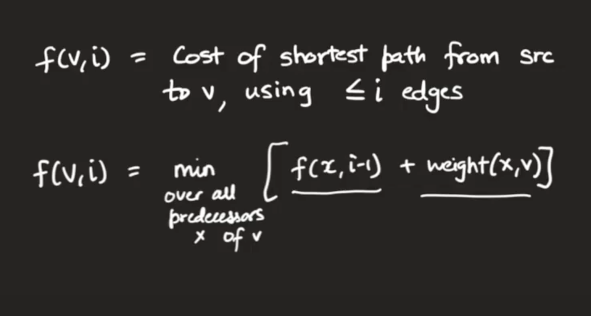
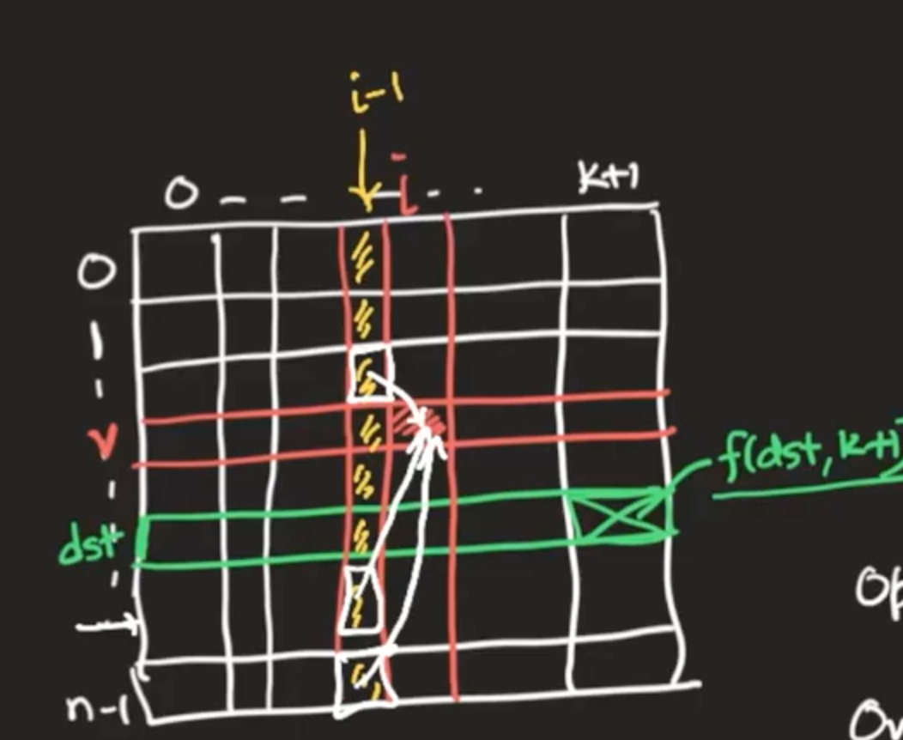
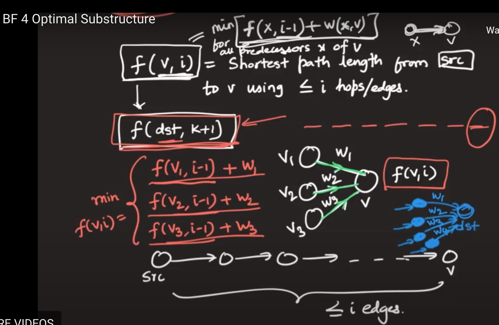
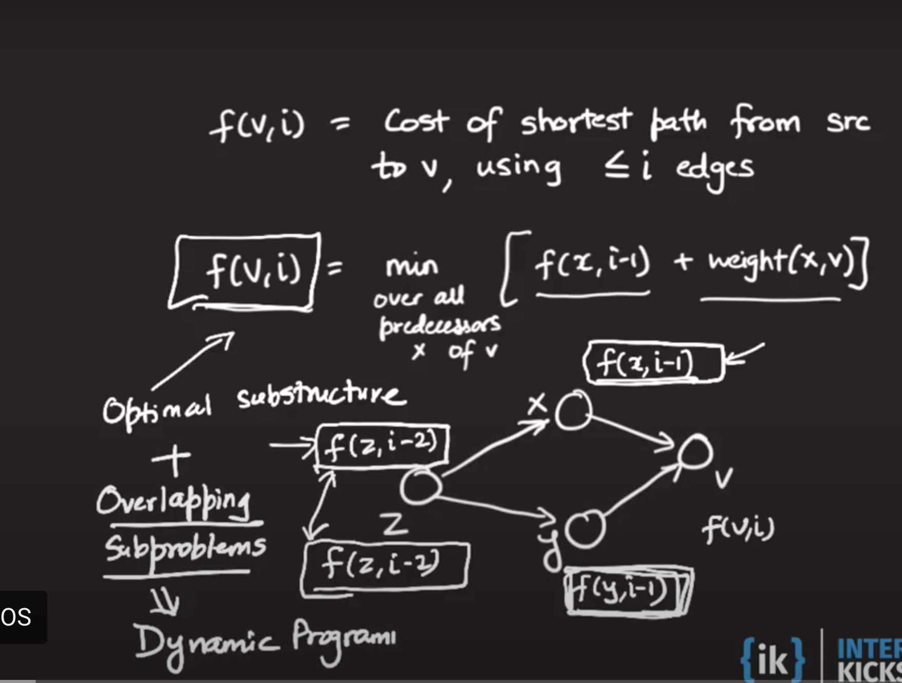

# Shortest Path algo based on edge weight
- Applicable for both directed and undirected graph
- Shortest path will not have cycle
- Shortest path is combinatorial optimization problem
- Dijkastra doesn't apply on negative weight
- Dijkastra is based on greedy algo using priority queue
- Bellman ford is based on dynamic programming
- Bellman ford is applicable on even negative weight

# Dijkastra Algo to get shortest path from source to destination
- Simple greedy approach doesn't solve the problem
- Based on optimal greedy approach
- Any prefix of the shortest path from `S` to `D` must also be optimal
- Build shortest path in increasing order of length 
- It only optimized as per the weight of the path
- It doesn't optimize as per the number of hops

# Cheapest flight with at most k stops/Bellman ford algo
https://leetcode.com/problems/cheapest-flights-within-k-stops/
https://leetcode.com/problems/network-delay-time/
- No need to calculate all predecsoor at a time
- Current hops can be initialize by previous value
- Look at each edge one at a time

- Dijkastra algo doesn't work for negative weight
- Bellman ford algo works even for negative weight (as long as there is not negative weight cycle)
- Dijkastra time complexity is O(n*logm)
- Bellman ford time complexity is O(m*n)

# DAG - Directed Acyclic Graph using DP
- Find all paths from S to D
- Find shortest path from S to D
- Find longest path from S to D
Time complexity: O (V+E)
> Use DP to solve all these problems
